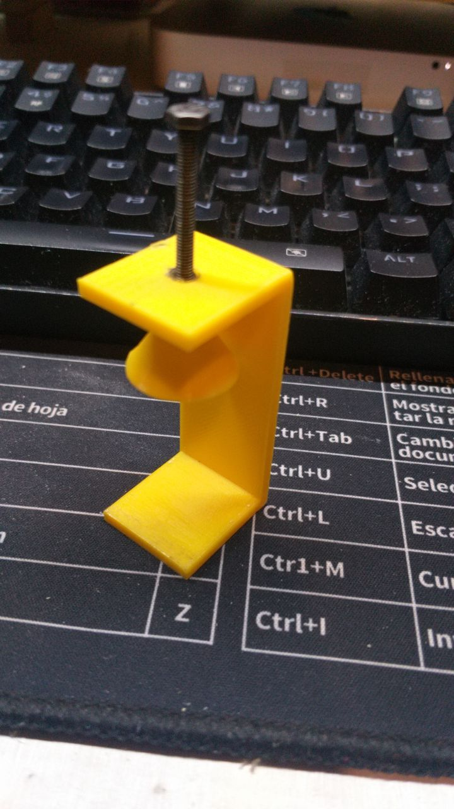
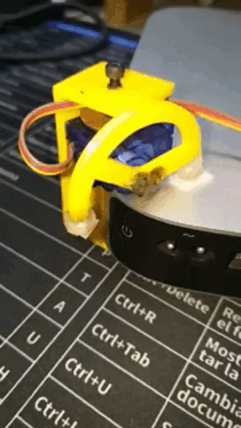
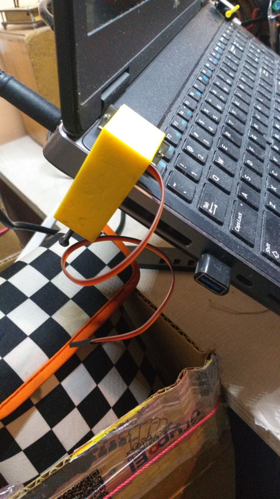

# Electronic Controled Switch for MAC mini and Laptops.

The purpose of this design is to provide an electronic controled switch to turn on a Mac Mini, however, this clamp can be used to attach the sytem to a laptop or a desktop Pc too. 

This design consists of:
* [The main part of the clamp.](/servoHolderForLaptop)
*  [A cone to make the clamp adjusment easier.](/coneForServoHolder)

* [A Custom arm for the servomotor. (only needed for the MAC mini assembly)](/macMiniPowerButtonServoAdapter)
* 1 M3x15mm screw. 
* 2 M3x3mm nuts. 
* 1 M3x3mm insert.
* An Arduino UNO/MEGA/DUE/Nano/Leonardo/ESP8266/NodeMCU/RaspberryPico/Attiny85 and the firmware [firmware](https://github.com/jjjpolo/unoTurnsOnMacMini) to control the servomotor.

## The assembly of the clamp looks like this:

## This is what the system looks like on a mac mini

## This is what the system looks like on a laptop

## This is what the system looks like on a laptop with a HD-1440A

## Getting you inspired.
At first glance you probably are thinking that this system does not seem be more than a dummy and unnecessary way to press the power button of your MAC mini/Laptop, but what if you connect the source power of the microcontroller to a smart plug and control this device with any Home Assitant such as Alexa, Google Home, Smart Home Assistant, Home Kit and so on.